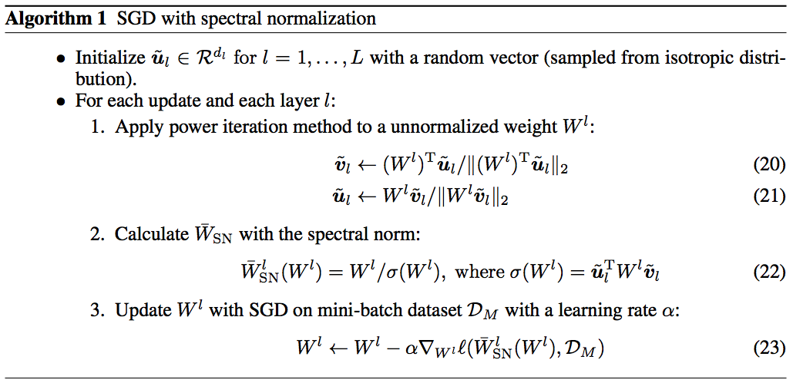

# Spectral_Normalization-Tensorflow
 Simple Tensorflow Implementation of [Spectral Normalization for Generative Adversarial Networks](https://openreview.net/forum?id=B1QRgziT-&noteId=BkxnM1TrM) (ICLR 2018)
 
 ## Usage
 ```bash
 > python main.py --dataset mnist --sn True
 ```
 
 ## Summary
 
 
 ## Simple Code
 ```python
def spectral_norm(w, iteration=1):
    w_shape = w.shape.as_list()
    w = tf.reshape(w, [-1, w_shape[-1]])

    u = tf.get_variable("u", [1, w_shape[-1]], initializer=tf.random_normal_initializer(), trainable=False)

    u_hat = u
    v_hat = None
    for i in range(iteration):
        """
        power iteration
        Usually iteration = 1 will be enough
        """
        v_ = tf.matmul(u_hat, tf.transpose(w))
        v_hat = tf.nn.l2_normalize(v_)

        u_ = tf.matmul(v_hat, w)
        u_hat = tf.nn.l2_normalize(u_)

    u_hat = tf.stop_gradient(u_hat)
    v_hat = tf.stop_gradient(v_hat)

    sigma = tf.matmul(tf.matmul(v_hat, w), tf.transpose(u_hat))

    with tf.control_dependencies([u.assign(u_hat)]):
        w_norm = w / sigma
        w_norm = tf.reshape(w_norm, w_shape)


    return w_norm
 ```
 
 ## How to use
 ```python
    w = tf.get_variable("kernel", shape=[kernel, kernel, x.get_shape()[-1], channels])
    b = tf.get_variable("bias", [channels], initializer=tf.constant_initializer(0.0))

    x = tf.nn.conv2d(input=x, filter=spectral_norm(w), strides=[1, stride, stride, 1]) + b
 ```
 
 ## Related works
 * [Group Normalization-Tensorflow](https://github.com/taki0112/Group_Normalization-Tensorflow)
 
 ## Author
 Junho Kim
